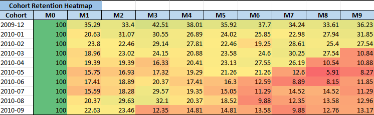
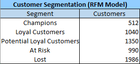
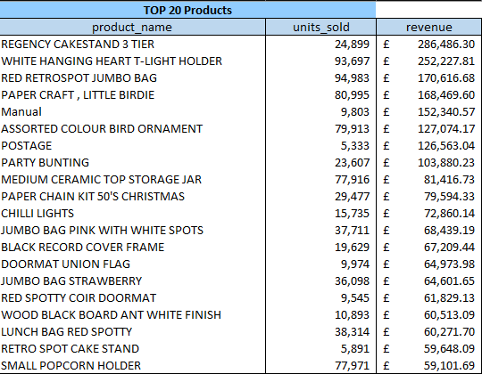
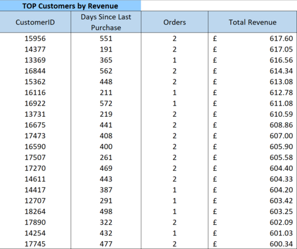

# Online Retail SQL Analytics Project

End-to-end SQL analytics pipeline built in **MySQL 8**, transforming raw e-commerce transaction data into actionable business intelligence.

---

## Table of Contents

1. [Quick Overview](#1-quick-overview)
2. [Data Preparation & Cleaning](#2-data-preparation--cleaning)
3. [Business Insights](#3-business-insights)
4. [Technical Implementation](#4-technical-implementation)
5. [Project Structure](#5-project-structure)
6. [Key Takeaway & Lessons Learned](#6-key-takeaway--lessons-learned)

---

## 1. Quick Overview

- **Dataset:** Online Retail II (Dec 2009 – Dec 2011)
- **Volume:** 1,060,000 raw transactions → ~800,000 cleaned transactions
- **Orders:** 36,969 unique orders
- **Customers:** 5,878 unique customers across multiple countries
- **Revenue:** £1,774,329.16

---

## 2. Data Preparation & Cleaning

### Issues Encountered & Solutions

**CSV Import Challenges**
- Large file size (~90MB) and MySQL `secure_file_priv` restrictions → Resolved using `LOAD DATA INFILE` with secure directory
- Excel formatting converted numeric IDs to floats (12345 → 12345.0) → Cast all IDs as VARCHAR during import, then INT during transformation
- Inconsistent delimiter/quote handling → Used `FIELDS TERMINATED BY ','` with `OPTIONALLY ENCLOSED BY '"'`

### Transformation Rules Applied

| Issue | Solution | Impact |
|-------|----------|--------|
| **Cancelled Orders** | Removed invoices starting with 'C' | -23,031 rows |
| **Negative Quantity** | Filtered Quantity < 0 | -1,907 rows |
| **Invalid Pricing** | Removed UnitPrice ≤ 0 | -3,265 rows |
| **Missing CustomerID** | Excluded NULL customers | -168,494 rows |
| **Result** | Clean analytical dataset | **36,969 valid orders** |

### Cleaning Process

```sql
-- Example: Create clean dataset
CREATE TABLE online_retail_clean AS
SELECT 
    InvoiceNo,
    CAST(CustomerID AS UNSIGNED) AS CustomerID,
    InvoiceDate,
    Quantity,
    UnitPrice,
    (Quantity * UnitPrice) AS Revenue
FROM online_retail_raw
WHERE InvoiceNo NOT LIKE 'C%'      -- Remove cancellations
  AND Quantity > 0                  -- Remove negative quantities
  AND UnitPrice > 0                 -- Remove invalid prices
  AND CustomerID IS NOT NULL;       -- Remove missing customers
```

---

## 3. Business Insights

### Key Metrics
- **Total Orders:** 36,969
- **Total Customers:** 5,878  
- **Repeat Customer Rate:** 72.39%
- **Average Order Value:** £479.95

## Business Insights

### Core Business KPIs


The cleaned dataset contains **36,969 valid orders from 5,878 unique customers**, generating **£1.77M in revenue**.

Key observations:

- **Average order value:** £479.95  
- **Repeat customer rate:** 72.39%

A repeat rate above 70% indicates strong customer loyalty and suggests that **customer retention strategies are likely to have higher ROI than purely focusing on new customer acquisition**.

---

### Customer Cohort Retention



Cohort analysis groups customers by the month of their **first purchase** and tracks their activity over time.

Key patterns:

- Retention drops significantly after the first purchase month (Month 0 → Month 1)
- Approximately **30–40% of customers continue purchasing in subsequent months**
- A stable core of repeat buyers persists across multiple months

This indicates a **healthy returning customer base**, although improving early-stage retention (Months 1–3) could significantly increase long-term customer value.

---

### Customer Segmentation (RFM Model)



Customers were segmented using the **RFM framework**:

- **Recency** – days since last purchase  
- **Frequency** – number of purchases  
- **Monetary value** – total spending  

Key findings:

- **512 "Champion" customers** represent the highest value segment
- **1,040 Loyal Customers** contribute steady repeat revenue
- **1,986 Lost Customers** represent a large reactivation opportunity

This segmentation enables targeted strategies such as:

- retention campaigns for **At Risk** customers
- loyalty rewards for **Champions**
- reactivation campaigns for **Lost** customers

---

### Product Performance



Revenue is concentrated among a relatively small number of products.

The top products — primarily decorative and home-gift items — generate a disproportionately large share of total revenue.

This suggests:

- strong demand for **seasonal and gift-oriented products**
- potential opportunity to expand similar product categories

---

### High-Value Customers



Customer-level revenue analysis shows that a small number of customers contribute significantly to total sales.

Top customers generate **£600+ in lifetime revenue**, despite relatively few orders.

This pattern is typical in retail, where **high-value repeat customers drive a large share of revenue**.

Strategies such as loyalty programs or targeted promotions could further increase the value of these customers.

---

## 4. Technical Implementation

**SQL Techniques:**
- `LOAD DATA INFILE` for bulk import with secure file handling
- Window functions (`NTILE`, `ROW_NUMBER`) for RFM scoring
- `TIMESTAMPDIFF` for cohort analysis
- Derived columns (Revenue, Month, Year) during transformation

**Data Quality Checks:**
- Row count validation at each pipeline stage
- NULL checks on critical fields (CustomerID, Quantity, UnitPrice)
- Revenue reconciliation (SUM validation)
- Date range validation

**Pipeline Architecture:**
Raw → Clean → Business → Analytics

---

## 5. Project Structure

```
01_schema_setup.sql          -- Create raw table
02_raw_import.sql            -- Load CSV data
03_clean_transform.sql       -- Apply cleaning rules
04_data_validation.sql       -- Validate output
05_business_kpis.sql         -- Compute metrics
06_time_trends.sql           -- Revenue analysis
07_customer_analytics.sql    -- Top customers
08_product_analytics.sql     -- Product performance
09_cohort_retention.sql      -- Retention modeling
10_rfm_segmentation.sql      -- Customer segmentation
```

---

## 6. Key Takeaway

This project demonstrates an end-to-end analytics workflow: importing messy raw data, cleaning and transforming it into a reliable analytical dataset, and using SQL to extract meaningful business insights.

## Lessons Learned

Working with raw transactional data revealed several common real-world challenges:

• CSV imports often contain formatting artifacts from Excel  
• Large datasets require careful import strategies in MySQL  
• Data cleaning frequently requires more effort than analysis itself  
• Ensuring data quality is critical before performing business analysis  

Addressing these issues was essential to produce a reliable analytical dataset.